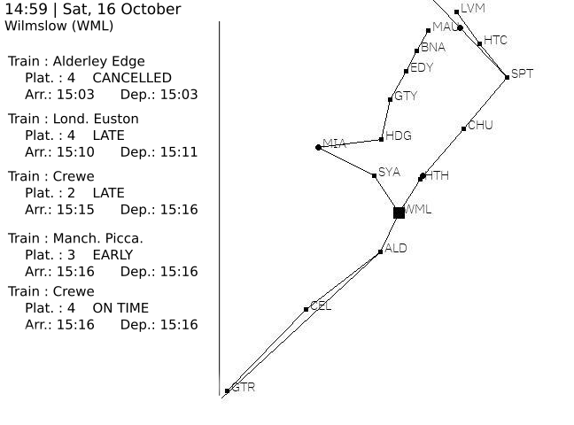

# E-Ink Trainstation

This repo contains the code needed to retrieve all the data from [Transport API](https://www.transportapi.com/)(Only working for United-Kingdom trainstation), display all the departures at a station, update a SVG template before pushing it to a Waveshare 5.83" E-ink display.

Note that the code has only been tested on the specific hardware mentioned and 3 customization are necessary to work with another E-Ink display.

## Table of contents
* [Background](#background)
* [Hardware and Tech](#hardware-and-tech)
* [How It Works](#how-it-works)
* [What's Next](#what-s-next)

##  Background
Few weeks ago, I was really interested into the E-Ink display after I saw [this post](https://www.mbta.com/projects/solar-powered-e-ink-signs).

I was totally in love with the flat design, the extremely low power consumption (26.4mW at refresh for the Waveshare screen) and this paper effect.

And in the same time, I was also curious in Python so... let's go ? I took the first API I could find on DuckDuckGo, bought an E-ink screen and during the time it took to arrive, I had time to think and design how I wanted to display the data.

So, first time I made my own project with a Raspberry Pi (instead of following some tutorial for a mediacenter, etc..), first time with Python and first time with an API.

## Hardware and Tech
* [Raspberry Pi Zero WH](https://www.raspberrypi.com/products/raspberry-pi-zero-w/) - Header pins are needed to connect to the E-Ink display
* [5.83inch E-Paper E-Ink, Black / White](https://www.waveshare.com/product/displays/e-paper/epaper-1/5.83inch-e-paper-hat.htm)

**Python:** 3.7.3

**Application needed:** [Inkscape 1.01](https://inkscape.org/)

**Librairies needed:** gpiozero, Pillow, numpy, requests, RPi.GPIO, spidev

## How it Works

For the moment, the script need to be launched manually but I think you can easily set it on boot.

This is how the script is executed:
* **Agenda Update:** To avoid requesting a large number of requests (limited to 1000 by the API), I implemented a schedule that is configurable in "config.json" to set the times and the screen refresh interval and data.
* **Data requests:** Request all the departures at the station and associated timetable and keep a simplified version of both of them.
* **Node Tree:** Create or update the map of train stations with the geolocation of the trainstation.
* **Image creation:** Update the [SVG template](asset/template.svg), create a map of the trainstation (represented with ■ ) and the approximate train position ( ● ) and merge the two result
*  **Final behaviour:** Display the result on the e-ink screen and sleep until the next update, the screen refresh, the agenda update or the data request.

## What's Next
